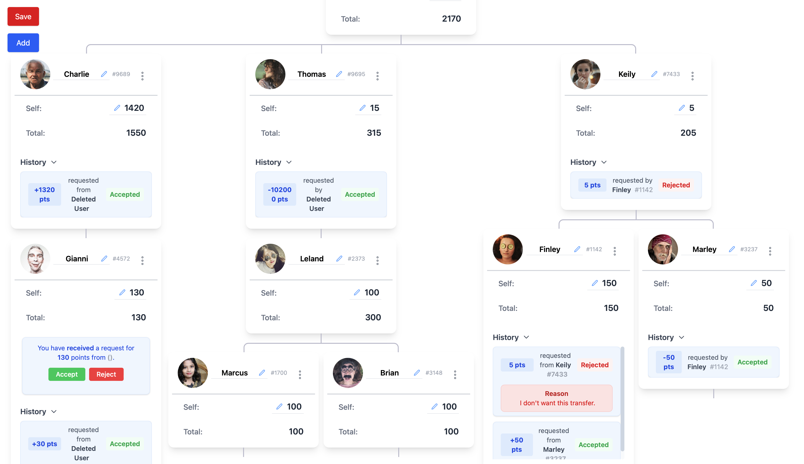

# Tree Project

A React + Vite application for managing hierarchical card trees, with point requests and transfers between cards. Built with React, Redux Toolkit, TailwindCSS, and organizational chart visualization.

---

## 🚀 [Live Demo](https://tree-task.vercel.app)

---

## App Preview



---

## 📋 About the Application

This application allows you to:

- **Create and manage card trees:** Add, edit, and delete cards in a hierarchical structure.
- **Multiple trees support:** You can add and manage more than one tree as separate structures within the app.
- **Track points:** Each card has a self and total value, automatically updating as you modify the tree.
- **Request and transfer points:** Cards can request points from each other. Requests can be accepted or rejected with a reason.
- **View history:** Each card displays a log of point transactions and requests.
- **Persistent state:** Save and load your progress using local storage.

Built with:

- React
- Vite
- Redux Toolkit
- TailwindCSS
- react-organizational-chart

---

## 🛠️ Getting Started

```sh
npm install
npm run dev
```

Open [http://localhost:5173](http://localhost:5173) to view the app.

---
